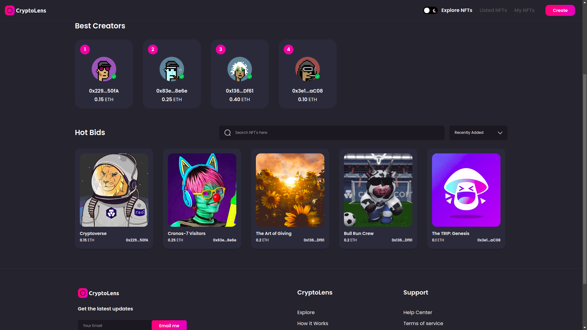
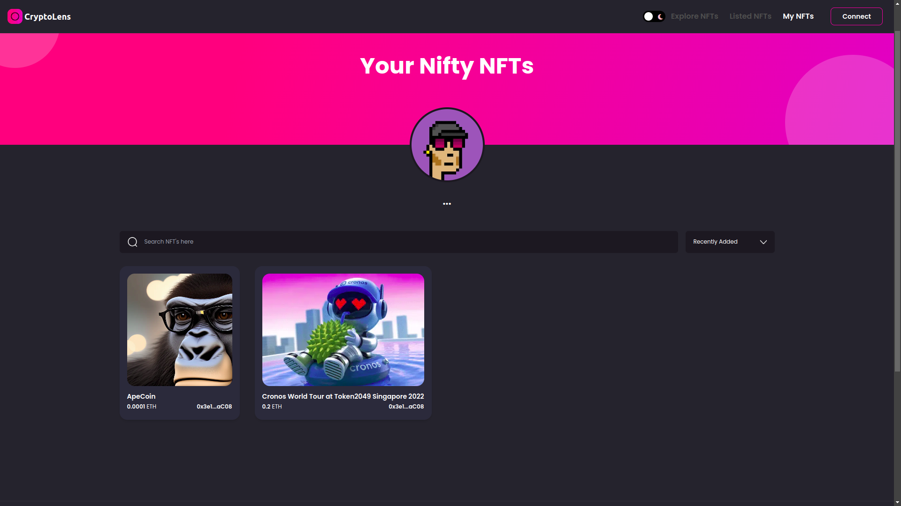
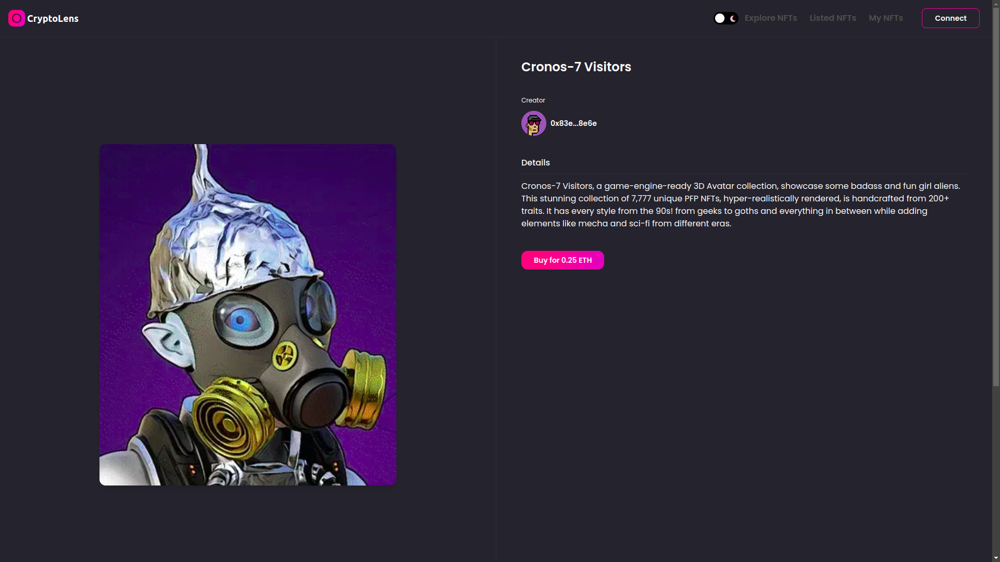
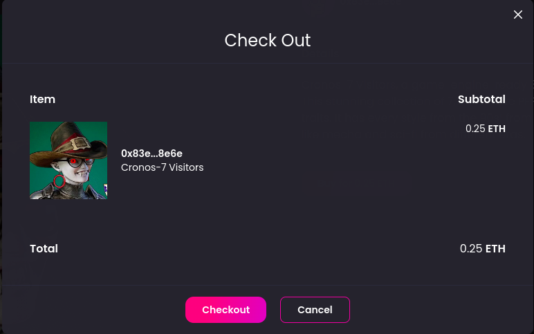

# crypto_lens

<!--
*** Thanks for checking out the CryptoLens. If you have a suggestion
*** that would make this better, please fork the repo and create a pull request
*** or simply open an issue with the tag "enhancement".
*** Don't forget to give the project a star!
*** Thanks again! Now go create something AMAZING! :D
-->

<!-- PROJECT SHIELDS -->
<!--
*** I'm using markdown "reference style" links for readability.
*** Reference links are enclosed in brackets [ ] instead of parentheses ( ).
*** See the bottom of this document for the declaration of the reference variables
*** for contributors-url, forks-url, etc. This is an optional, concise syntax you may use.
*** https://www.markdownguide.org/basic-syntax/#reference-style-links
-->

<!-- PROJECT LOGO -->
 

  

  <h3 align="center">CryptoLens</h3>

  

    Elegant NFT Marketplace
     
    <a href="https://github.com/Vishnu2562000/crypto_lens"><strong>Explore the docs »</strong></a>
     
     
    <a href="https://github.com/Vishnu2562000/crypto_lens/issues">Report Bug</a>
    ·
    <a href="https://github.com/Vishnu2562000/crypto_lens/issues">Request Feature</a>
  

<!-- TABLE OF CONTENTS -->

  
Table of Contents

  <ol>
    <li>
      <a href="#about-the-project">About The Project</a>
    </li>
    <li>
      <a href="#getting-started">Getting Started</a>
    </li>
    <li>
      <a href="#technologies-used">Technologies Used</a>
    </li>
    <li><a href="#features">Features</a></li>
    <li><a href="#contributing">Contributing</a></li>
    <li><a href="#license">License</a></li>
    <li><a href="#contact">Contact</a></li>
  </ol>

<!-- ABOUT THE PROJECT -->

## About The Project

CryptoLens is an NFT marketplace built using Solidity and Next.js. This project combines the futuristic elements of Web3 blockchain development and the popular culture wave of non-fungible tokens (NFTs).

With CryptoLens, you can create, buy, sell, and resell NFTs while authenticating users through their Metamask wallet. The theme can be switched between dark and light modes to suit your preferences.

Context API is used for state management, while Tailwind CSS is used for styling the application. Solidity is used to write smart contracts, and Hardhat is used to deploy them.

<table>
<tr>
<td>

</td>
</tr>
<tr>
<td>

</td>
</tr>
<tr>
<td>

</td>
</tr>
<tr>
<td>

</td>
</tr>
</table>

(<a href="#readme-top">back to top</a>)

## Getting Started

To get started with CryptoLens, follow these steps:

1. Clone the repository
2. Install dependencies using npm install
3. Create an alchemy account and use your credentials to update .env file
4. store the necessary data in IPFS storage
5. Run the application using npm run dev
6. Connect your Metamask wallet to the application
7. Use the goerli testnet for performing any transactions

(<a href="#readme-top">back to top</a>)

<!-- Tech Stack used -->

## Technologies Used

1. Solidity
2. Next.js
3. Context API
4. Tailwind CSS
5. Hardhat
6. IPFS storage
7. Alchemy API

(<a href="#readme-top">back to top</a>)

<!-- Features -->

## Features

- [x] Switch between Dark/Light themes
- [x] Top Authors List (ordered by income) and Bids (ordered by date)
- [x] Bid details
- [x] Modal window for checkout (bid page)
- [x] Search for all bids and author bids
- [x] Sort bids by price and date
- [x] User authentication through Metamask wallet
- [x] Mint,Buy, Sell or Resell NFTs
- [x] Commision for Marketplace contract for every new NFT
- [x] Every transaction stored in goerli testnet [block explorer](https://goerli.etherscan.io/) in etherscan

See the [open issues](https://github.com/Vishnu2562000/crypto_lens/issues) for a full list of proposed features (and known issues).

(<a href="#readme-top">back to top</a>)

<!-- CONTRIBUTING -->

## Contributing

Contributions are what make the open source community such an amazing place to learn, inspire, and create. Any contributions you make are **greatly appreciated**.

If you have a suggestion that would make this better, please fork the repo and create a pull request. You can also simply open an issue with the tag "enhancement".
Don't forget to give the project a star! Thanks again!

1. Fork the Project
2. Create your Feature Branch (`git checkout -b feature/AmazingFeature`)
3. Commit your Changes (`git commit -m 'Add some AmazingFeature'`)
4. Push to the Branch (`git push origin feature/AmazingFeature`)
5. Open a Pull Request

(<a href="#readme-top">back to top</a>)

<!-- LICENSE -->

## License

Distributed under the MIT License. See [`LICENSE`](https://github.com/Vishnu2562000/crypto_lens/blob/main/LICENSE) for more information.

(<a href="#readme-top">back to top</a>)

<!-- CONTACT -->

## Contact

Vishnu Vardhan Chandragiri - [chandragirivishnuvardhan@gmail.com](mailto:chandragirivishnuvardhan@gmail.com)

Project Link: [https://github.com/Vishnu2562000/crypto_lens](https://github.com/Vishnu2562000/crypto_lens)

(<a href="#readme-top">back to top</a>)

